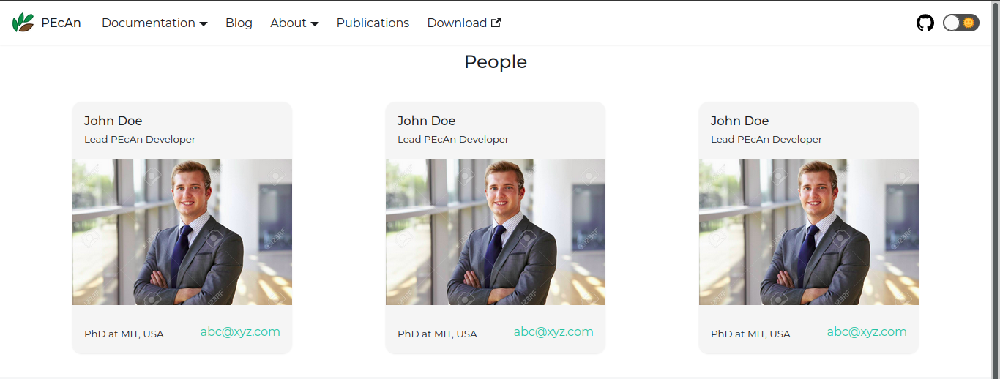

# Website

This website is built using [Docusaurus 2](https://docusaurus.io/),a modern static website generator,
as part of [GSoC '21](https://summerofcode.withgoogle.com/).

## Table of contents

<details open="open">
  <summary>Table of Contents</summary>
  <ol>
    <li>
      <a href="#getting-started">Getting Started</a>
      <ul>
        <li><a href="#prerequisites">Prerequisites</a></li>
        <li><a href="#installation">Installation</a></li>
        <li><a href="#local-development">Local Development</a></li>
        <li><a href="#build">Build</a></li>
      </ul>
    </li>
    <li>
      <a href="#adding-content">Adding Content</a>
      <ul>
        <li><a href="#feature-cards">Feature Cards</a></li>
        <li><a href="#pecan-people">PEcAn People</a></li>
        <li><a href="#blog">Blog</a></li>
      </ul>
    </li>
    <li><a href="#screenshots">Screenshots</a></li>
    <li><a href="#contributing">Contributing</a></li>
    <li>
      <a href="#next-steps">Next Steps</a>
      <ul>
        <li><a href="#optimising-documentation">Optimising documentation</a></li>
        <li><a href="#adding-tutorials">Adding tutorials section</a></li>
        <li><a href="#blog">Blog</a></li>
      </ul>
    </li>
  </ol>
</details>

## Getting Started

This section will help one to setup the project for local development.

### Prerequisites

This project has been built using [Docusaurus 2](https://docusaurus.io/), so make sure that your machine has Node version >=12.13.0, you can check this using `node -v`. [Install node](https://nodejs.org/en/download/).
Make sure yarn is installed. [Install yarn](https://classic.yarnpkg.com/en/docs/install/#debian-stable)

### Installation

```console
yarn install
```

### Local Development

```console
yarn start
```

This command starts a local development server and opens up a browser window. Most changes are reflected live without having to restart the server.

### Build

```console
yarn build
```

This command generates static content into the `build` directory and can be served using any static contents hosting service.

## Adding Content

This section will help to add or modify Website's content.

### Feature Cards

Feature Cards are cards present at the website homepage whose main purpose is to highlight the key features of the PEcAn Project.


To modify its contents-

- Navigate to `src/components/HomepageFeatures.js`
- Navigate to `const FeatureList` inside `HomepageFeatures.js`


Every item inside `FeatureList` array contains a JavaScript object enclosed `{}` and separated by `,` . Each of these objects is a feature that is displayed on the homepage and contains a `title`, `Svg` and `description`. One can edit or remove them as required, the changes will be reflected after the code passes build test. If one is editing `Svg` make sure that the required image file is present inside `static/img` directory, otherwise the compiler would return an error.

### PEcAn People

The people page contains details of the PEcAn team. The image here is a representation of how the page should look like with placeholder values.



To add and modify information move to the `static/utils/contributors.js` file. It contains an array called `contributors` which contains JavaScript objects which are enclosed by `{}` and contain following fields-


In order to add a contributor, copy any object enclosed by `{}` and paste after the last object. Make sure two objects are separated by a `,`. Now one can easily edit information in the pasted object.
One could add information accordingly in the different fields. The information would be automatically updated after successful push.

### Blog

The blog can be found at the top, in the navigation menu. It comes by default in docusaurus and more information about it can be found on (https://docusaurus.io/docs/blog). By default when someone clicks on `docs` link they will be directed to a page containing list of all present blogs on the website.

To add a blog, navigate to `blog` directory in the repository and create a '.md' file. To know more about markdown visit (https://guides.github.com/features/mastering-markdown/). Make sure to name the file in `yyyy-mm-dd-title.md` format, this makes it easier for parser to render blogs. In the top of your blog file add a yaml header similar to the picture below.


The `title`, `author` and `tags` are important for giving the blog a meaning and making it more user friendly. To know more about these yaml headers visit (https://docusaurus.io/docs/blog#header-options). After adding the yaml headers you can start writing your blog and save the file. After successful push the blog would be added to the website.

## Screenshots

This section contains screenshots of website's homepage in light and dark theme.


## Contributing

This is an open source project and contributions are what make an open source community.
Everyone is welcome to contribute to this project. The rules are simple:

- Be polite, be patient.
- Be specific about your doubts, make sure you read this documentation carefully.

First time contributors are welcome. Contributions can be very simple, make sure to check out beginner friendly issues, if present.

## Next Steps

This section contains future plans for the website. New contributors can use this section as a reference for planning their contributions.

### Optimising Documentation

At present the PEcAn's documentation is being served from (https://pecanproject.github.io/pecan-documentation/master/) using an iframe. While this saves a lot of overhead in converting Rmd files in (https://github.com/PecanProject/pecan/tree/develop/book_source) to md files so that docusaurus could render them, it also increases the loading time for documentation, it also looks less consistent.
In future, it is suggested to find an optimised way to convert rmd files to md and integrate them via docusaurus's native documentation parser.
### Adding tutorials section

The tutorials section from old site need to be migrated into the new site. One can find tutorials here (https://github.com/PecanProject/pecan/tree/develop/documentation/tutorials).